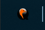
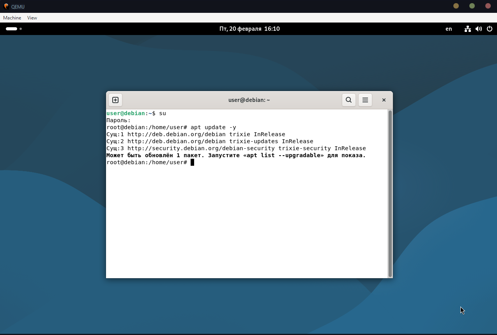
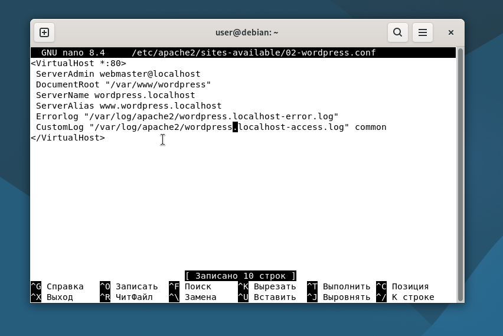
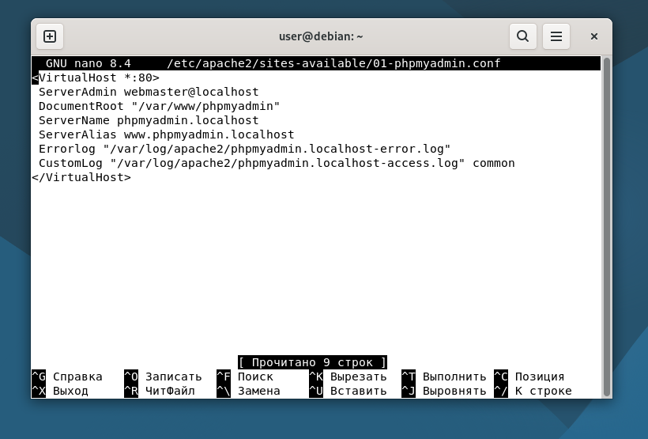
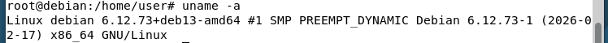
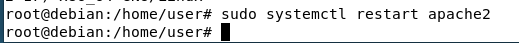
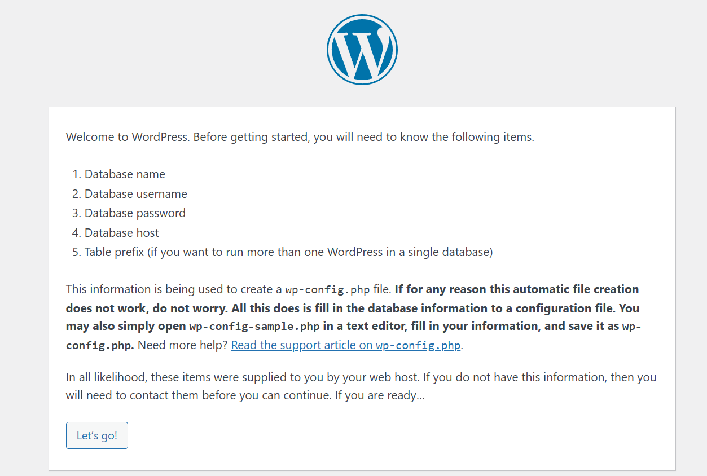
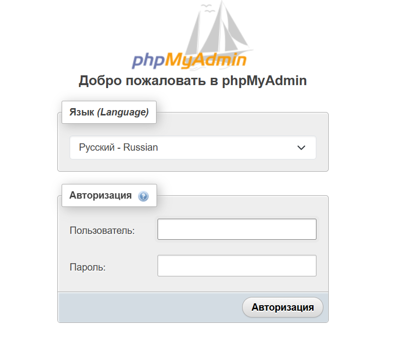

# Лабораторная работа №2

## Виртуальный сервер

**Берёзова Ева,
Группа I2402**

## Задача

Развернуть виртуальный сервер на базе Debian с использованием QEMU, установить и настроить LAMP-стек (Apache HTTP Server, MariaDB, PHP), а также выполнить установку и конфигурацию WordPress и phpMyAdmin.

## Выполнение

Я создала новый репозитория и необходимые файлы.
Файл iso именовала в просто debian, без всяких буковок-циферок после. Переместила его в папку dvd.
Далее приступила к установке ОС Debian.
(во время установки мне настойчиво не давали сделать скрины, но могу доказать это иконкой)



К слову, устанавливался он достаточно долго

Использовала команды, данные в задании

Далее я перезапустила виртуальную машину и приступила к установке LAMP. Вот немного процесса:



А также список пакетов и их назвачения:

| Пакет | Для чего нужен |
|-------|----------------|

| apache2 | Сам веб-сервер. Принимает запросы от браузера и отдает страницы сайта. |
| php | Язык программирования, на котором написаны сайты. Позволяет делать страницы динамическими. |
| libapache2-mod-php | Связка Apache и PHP. Чтобы Apache понимал PHP-код. |
| php-mysql | Связка PHP и базы данных. Чтобы PHP мог читать/писать данные в БД. |
| mariadb-server | Сервер базы данных. Хранит все данные сайта (статьи, пользователей, пароли). |
| mariadb-client | Программа для ручной работы с БД через консоль. |
| unzip | Распаковка ZIP-архивов (например, чтобы загрузить готовый сайт). |

Далее у нас установка СУБД и  WordPress
Я ввела данные команды в терминал виртуальной машины

`wget <https://files.phpmyadmin.net/phpMyAdmin/5.2.2/phpMyAdmin-5.2.2-all-languages.zip>`

`wget <https://wordpress.org/latest.zip>`

Создала базу данных

```sql
mysql -u root
CREATE DATABASE wordpress_db;
CREATE USER 'user'@'localhost' IDENTIFIED BY 'password';
GRANT ALL PRIVILEGES ON wordpress_db.* TO 'user'@'localhost';
FLUSH PRIVILEGES;
EXIT;
```

Далее создаю 2 файла





Добавляю строки в hosts


## Запуск и тестирование

Выполняю команду в консоли:



Перезагружаю Apache



И проверяю доступность сайтов





К счастью, все хорошо, и они загрузились

## Вопросы

1. Каким образом можно скачать файл в консоли при помощи утилиты wget?

Файл скачивается командой wget `<URL>`. Например, wget `https://wordpress.org/latest.zip`.

1. Зачем необходимо создавать для каждого сайта свою базу и своего пользователя?

Для каждого сайта создают отдельную базу и пользователя, чтобы данные были изолированы. Это повышает безопасность и удобство управления.

1. Как поменять доступ к системе управления БД на порт 1234?

В MariaDB меняют port в конфигурационном файле и перезапускают сервис. Например, port = 1234.

1. Какие преимущества, с вашей точки зрения, даёт виртуализация?

Позволяет запускать несколько ОС на одном ПК без риска для основной системы. Упрощает тестирование и создание резервных копий.

1. Для чего необходимо устанавливать время / временную зону на сервере?

Настройка времени нужна для корректных логов и работы планировщика cron. Без правильной зоны приложения могут работать с ошибками.

1. Сколько места занимает установленная вами ОС (виртуальный диск) на хостовой машине?

Установленная система занимает примерно 2–3 ГБ на виртуальном диске. Точный размер зависит от выбранных пакетов.

1. Какие есть рекомендации по разбиению диска для серверов? Почему рекомендуется так разбивать диск?

Разделяют /, /var, /home и другие для безопасности и удобства бэкапов. Так логи или данные не забьют корневой раздел
